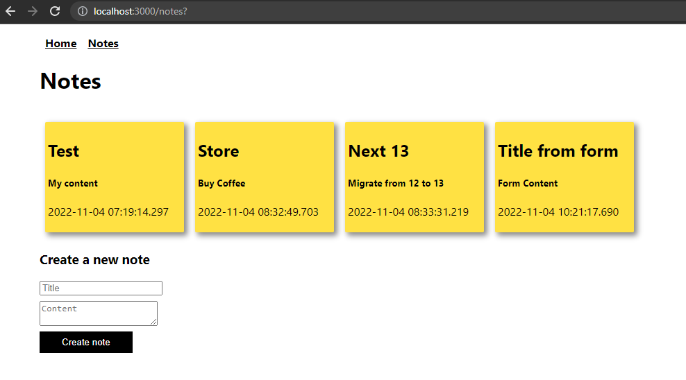

# Next 13 Notes

Build a simple notes app with Nextjs 13 and Pocketbase.



## Setup

1. Create a new Next.js app: `npx create-next-app@latest --ts`
2. Download Pocketbase from [pocketbase.io](pocketbase.io)
3. Unzippe your packet and navigate inside `cd pocketbase[version]`
4. Start Pocketbase: `./pocketbase serve`
5. Open the [Admin UI](http://127.0.0.1:8090/_/), create collection, and update security rules to allow read/write access. 
6. Change `ReactStrictMode` to `false` and add `experimental: { appDir: true }` to `next.config.js` 


This is a [Next.js](https://nextjs.org/) project bootstrapped with [`create-next-app`](https://github.com/vercel/next.js/tree/canary/packages/create-next-app).

## Getting Started

First, run the development server:

```bash
npm run dev
# or
yarn dev
```

Open [http://localhost:3000](http://localhost:3000) with your browser to see the result.
